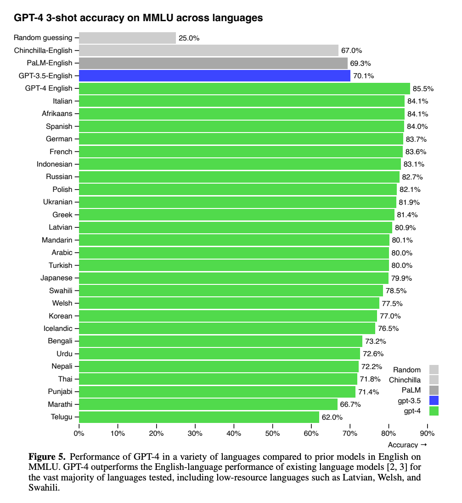

# GPT-4 Technical Report
* Multimodal model
* Transformer-style model
* Accept image and text inputs and produce text outputs
* Human-level performance on various professional and academic benchmarks
* GPT-4 achieves a score that falls in the top 10% of test takers. This contrasts with GPT-3.5, which scores in the bottom 10%.
* GPT-4 substantially improves over previous models in the ability to follow user intent.
* GPT-4 significantly reduces hallucinations relative to previous GPT-3.5 models.

### Training
GPT-4 is a Transformerbased model pre-trained to predict the next token in a document.
The training data include publicly available data (such as internet data) and data licensed from third-party providers.

The model was then fine-tuned using Reinforcement Learning from Human Feedback (RLHF).
Human in the loop prevents the model from responing to unappropriate inputs.
So the model is steered by human feedback to some extent.
There are two categories; disallowed and sensitive content, which the model is not allowed to respond to.

### Example use cases
* Dialogue systems
* Text summarization
* Machine translation
* etc.

### Evaluation
Evaluation has done using similar smaller models.
The small models was also compared to the big model (GPT-4) to make sure they are comparable.
Exam questions included both multiplechoice and free-response questions.
GPT-4 exhibits human-level performance on the majority of these professional and academic exams.

### Limitations
* Suffer from "hallucinations"
* Limited context window
* GPT-4 generally lacks knowledge of events that have occurred after the vast majority of its pre-training data cuts off in September 2021
* Overly gullible in accepting obviously false statements from a user
* Does not learn from experience
* Some other limitiations / conserns include: bias, disinformation, over-reliance, privacy, cybersecurity, proliferation, and more

### Language support

