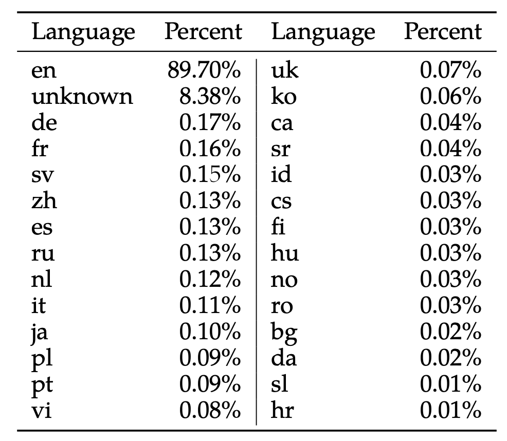

# Llama 2
* Released in mid July 2023
* 7B, 13B, and 70B parameters
* 40% more data than Llama 1
* Context length of 4096 tokens
* Total vocabulary size is 32k tokens
* Chat version finetuned with Reinforcement Learning with Human Feedback (RLHF) + Reward Modeling
*

## Paper notes (Llama 2: Open Foundation and Fine-Tuned Chat Models)
* Llama 2-Chat: optimized for dialogue use cases.

### Win rate vs other solutions
Overall, the performance of Llama 2-Chat is close in performance to that of GPT-3.5, and outperforms other open source solutions.

**Benchmark (Supervised fine-tuning version) vs close sourced models**:

**Other solutions**:

### Training LLMs
Auto-regressive transformers are pretrained on an extensive corpus of self-supervised data, followed by alignment with human preferences via techniques such as Reinforcement Learning with Human Feedback (RLHF). Although the training methodology is simple, high computational requirements have limited the development of LLMs to a few players

### Safety
We have taken measures to increase the safety of these models, using safety-specific data annotation and tuning, as well as conducting red-teaming and employing iterative evaluations. Additionally, this paper contributes a thorough description of our fine-tuning methodology and approach to improving
LLM safety

* Llama claims to be safer than GPT-3 and all other open source solutions.

**The RLHF was trained to be harmless**:
Several iterations were made to make it more harmless and more helpful. This is the evolution of **Llama 2-Chat**:

**Showcase os safety improvements**:

**Llama claims better safety than ChatGPT and PaLM**:

### Difference from Llama 1
* Llama 2 was trained on 40% more data than Llama 1.
* Llama was double the context length (4096) compared to Llama 1 (2048).

### Research and Commercial use

### Responsible use guide

### Language for training
Pretraining data is mostly English, it also includes text from a small number of other languages.

FastText language detection tool was used to determine langauge (when the threshold was above 0.5).

A training corpus with a majority in English means that the model may not be suitable for use in other languages. Most data is in English, meaning that Llama 2 will perform best for English-language use cases. The large unknown category is partially made up of programming code data.

Furthermore, our initial version of Llama 2-Chat predominantly concentrated on English-language data. While our experimental observations suggest the model has garnered some proficiency in other languages, its proficiency is limited, due primarily to the limited amount of pretraining data available in non-English languages (as documented in Table 10). Consequently, the model’s performance in languages other than English remains fragile and should be used with caution.

### Truthfulness, Toxicity, Bias
Llama 3 was also measures in terms of Truthfulness, Toxicity, Bias using opens ource datasets.
* TruthfulQA
* ToxiGen

### Dataset and personal data
Meta made an effort to remove data from certain sites known to contain a high volume of personal information about private individuals.

### Tokenizer in Llama
Llama executes the **bytepair encoding (BPE)** algorithm using SentencePiece library developed by Google.

**The SentencePiece tokenizer treats the space at the beginning of words as part of the token during tokenization**. This helps differentiate standalone words from the same sequences appearing as part of other words. However, when decoding a sequence of tokens back into a sentence, SentencePiece does not prepend a space to the first token in the sequence, even if this token represents a standalone word. This is usefull because it differentiates standalone words from sequences within other words, enhancing the precision of tokenization.

However, this behavior, which may differ from some other tokenizers, is often referred to as a "quirk" of SentencePiece.

The total vocabulary size is 32k tokens.

