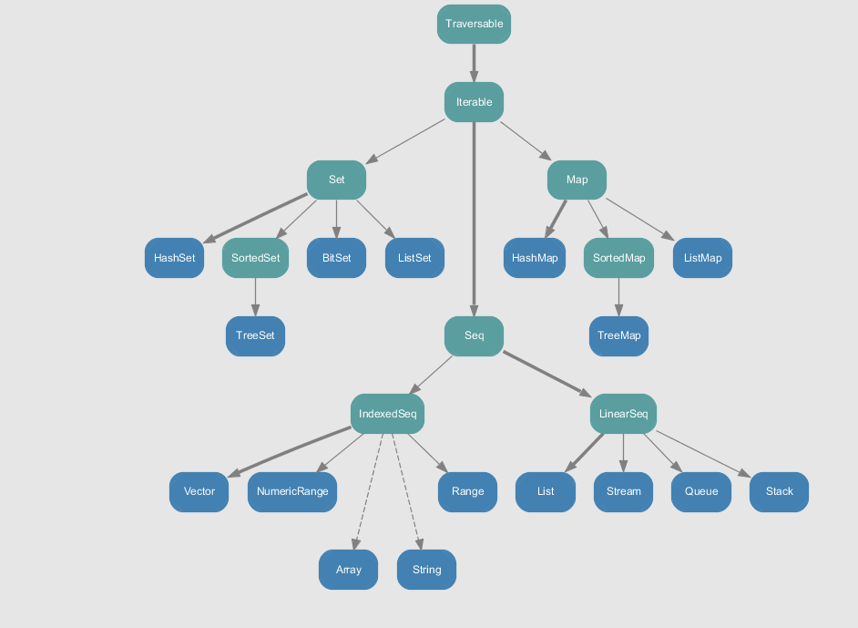

# Collections
* Collections can be strict or lazy. 
* There are two Scala collection packages to note:
  * **scala.collection**: Mutable collections.
  * **scala.collection.immutable**: Immutable collections.
    * May still contain mutable items
* 

### Scala Collections Hierarchy
This is the most important Scala collection classes:

### Traversable
Traversable is the base trait. This trait contains the abstract function **foreach**.

### TODO:
meaning of "--" in collections.
