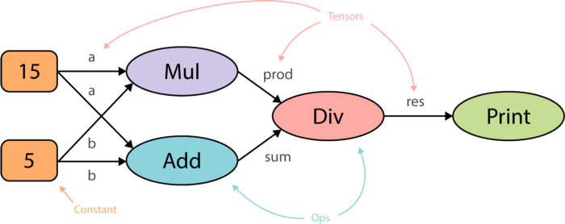

# Tensorflow Fundamentals

### Basic Info
* Open source
* Used for large scale ML/DL applications
* Created by Google, part of Google Brain
* TF is used in Google Maps, Gmail, and more
* TF is considered difficult to adopt compared to PyTorch, Theano, OpenCV, etc
* TF 2 tries to be simpler than TF 1
* TF 2 was released in September 2019

### Tensorflow's main components
Tensorflow is basically a combination of two components:
1. Computational graph library
2. A runetime for executing computational graphs

### What is a Tensor?
A tensor is simply a multidementional array.
* Scalar is a zero-dimentional tensor (rank 0 tensor)
* Vector is a one-dimentional tensor (rank 1 tensor)
* Matrix is a two-dimentional tensor (rank 1 tensor)

A tensor has a shape inducating the number of values in each dimension:
* The shape of scalar “42” is []
* The shape of vector “[5,6,7]” is 3
* The shape of matrix “[[6,7,5,6,7],[4,6,7,9,8]]” is [5, 2]

**In Tensorflow 2, a tensor can "mentally" be replaced with a Numpy ndarray**.

### Flow - Graph
“Flow” in Tensorflow refers to the underlying graph computation framework that uses tensors for its execution. TensorFlow uses directed acyclic graphs internally to represent computations, which is called **computational graphs** or **data flow graphs**.
* Computations are hierarchical
* The computational graph in Tensorflow is directed acyclic
* Nodes represent operations or variables
* Edges correspond to tensors
* Leaf nodes represent transformed tensors
* Nodes in the same level can be computed in prallel

The bennefits of struturing our program with a directed acyclic graphs are:
* Easier for parallelisation
* Dependency based scheduling
* Abstracting complex expressions and computations without actually evaluating the values
* Better portability (since a graph is language agnostic)
    * We can store the model using Probuff and restore it in another language, for example C++

Here is an example of a tensorflow program with a diagram:
```python
import tensorflow as tf

with tf.Session() as session:
    # Step 1: Creating the computational graph
    a = tf.constant(15)
    b = tf.constant(5)
    prod = tf.multiply(a, b)
    sum = tf.multiply(a, b)
    res = tf.divide(mul, sum, b)

# Step 2: Running the session
out = session.run(res)
print(out)
```


### Tensorflow Graph Basics
A computational graph in Tensorflow can be build using several components:
* **Variables**: Variables in Tensorflow represent shared, perisstent states that can be manipulated by *Operations*. Variables can be modified. But, Variables have to be initialized before running the graph session.
* **Operations**: Represent nodes in the Graph. Operations (Ops) perform computations on tensors according to spesific rules.
* **Placeholders**: Placeholders is defined with a shape and a datatype and work as "empty nodes". The value for placeholders are provided at a later stage. They are typically used for feeding in inputs and labels.
* **Constants**: Parameters that cannot be changed.
* **Graph**: The other components are part of a spesific graph.
* **Session**: Creates the runtime. It allocates memory and store values for intermediate results and variables.

Tensorflow provides a **default graph** when creating a sesion, so we don't actually have to initializw a Graph object since we can the default graph. But for advanced users, it is possible to create multiple graphs.

To analyse Tensorflow graphs, we can use **Tensorboard**.

### Lazy evaluation in Graphs
Tensorflow 1 is lazily evaluated, see exmaple below:
```python
# Out of memory error!
a = np.zeros(int(1000000000000), int(1000000000000))

# Ok! Since allocation is delayed until the graph is executed.
a = tf.zeros(int(1000000000000), int(1000000000000))
```

The distinction between declaration and allocation allows Tensorflow to distributde the workload on different machines.


## New in 2.0
* Distributed training vs. single node training uses the same code!
* InteractiveSession is not needed
* graph definition is not needed
* Variable initialization is not needed
* Variable sharing via scopes is not needed
* Lifetime of state objects is determined by the lifetime of their corresponding Python object, not the session object
* Less reduntant code (trying to make it a preferred way of adding opimizers, metrics, losses, layers, etc)
* Better documentation

### Comparing Tensorflow 1.0 to 2.0 syntax
TF 1.0
```python
graph = tf.Graph()
with graph.as_default():
    a = tf.constant([[10,10],[11.,1.]])
    x = tf.constant([[1.,0.],[0.,1.]])
    b = tf.Variable(12.)
    y = tf.matmul(a, x) + b
    init_op = tf.global_variables_initializer()
with tf.Session() as sess:
    sess.run(init_op)
    print(sess.run(y))
```
TF 2.0
```python
a = tf.constant([[10,10],[11.,1.]])
x = tf.constant([[1.,0.],[0.,1.]])
b = tf.Variable(12.)
y = tf.matmul(a, x) + b
print(y.numpy())
```

### Eager evaliation with Tensorflow 2.0
* TF 1.0 used lazy evaluation, but in Tensorflow 2.0, eager execution is enabled by default - making debugging easier
* Eager execution is an environment that evaluates operations immediately **without building graphs**
* Eager execution allow users to see numbers instead of graphs
* Eager evaluation works great with numpy
* Reduces boilerplate code
* Introduces natural control flow, instead of graph control flow
* Simplifies prototyping

Note that eager execution is **slower than graph execution**. However, trained models are saved as graphs no matter which execution option you choose.

```python
tf.enable_eager_execution()
tf.executing_eagerly()
print(...)
```

### Estimator and Keras
**Estimator** was the go-to high-level API of Tensorflow 1. In Tensorflow 2, **Keras** is the preferred high-level API. **tf.keras** was originally meant for small-scale models in Tensorflow 1, while **Estimator** was designed for scaling ML training in Tensorflow. Estimator was designed spesifcally for Tensorflow 1 and required sessions. Tensorflow 2.0 combines the power of the simple Keras syntax and the power of estimators in **tf.keras**.


## tf.function
**tf.function** converts normal Python code into Tensorflow graph code using the **@tf.function** decorator. This will compile the code to **C++**, meaning that the next time you run the function, it will run much faster!

If you need performance, use **tf.function**!

Example:
```python
@tf.function
def my_tf_function(x):
  a = tf.constant([[2.0], [3.0]])
  b = tf.constant(4.0)
  return a+b
```
Side effects of using tf.function:
* print() works only once. Use tf.print() instead.


## Distibuted programming in Tensorflow 2
Tensorflow allows the user to spesify a distributed programming strategy using the **tf.distribute.Strategy** module. 

However, **Model.fit** in keras is built in distributed.

Some questions we need to ask ourself before when we are distributing work load:
* Are tasks independent or de they need synchronization?
* Do we have any global variables for all workers?

All we need to do to run our single node code distributed is to wrap it in a **strategy scope**.

There are different types of strategies:
* **Synchronous**: all workers train over different slices of input data in sync.
    * MirroredStrategy
* **Asynchronous**: all workers are independently training over the input data and updating variables asynchronously.
* **Hardware platform**: Use multiple GPUs on a single machine.

**tf.distribute.MirroredStrategy** supports synchronous distributed training on multiple GPUs on one machine.

```python
strategy = tf.distributed.MirroredStrategy()
with strategy.scope():
    # Input the same code as for single node
    ...
```

## Tensorflow with Databricks
Tensorflow can be used with Databricks by adding the Tensorflow library to the Databricks cluster.


## tf.data
```python
tf.data.Dataset.from_tensor_slices(my_inputs, my_labels).shuffle().batch(32)
```


## Tensorflow low level API
TODO


## Supervised Learning with TensorFlow


## TensorFlow Datasets and Estimators


## tf.distribute.DistributedDataset
