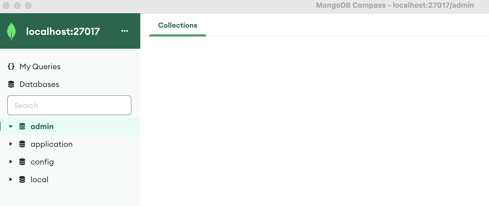

# MongoDB
* MongoDB is a NoSQL (document oriented data model) database management system.
* Allows easy querying and indexing.
* MongoDB is known to be scalable and be able to handle large amounts of data.
* Flexible data model and stores data in JSON, that is converted to BSON (Binary JSON).


### Document
* Each data object in MongoDB is a `document`.
* All objects has an `_id` that is automatically generated.
* Documents are in JSON format, and stored in BSON (Binary JSON) format.
    * BSON is a data serialization format that extends the JSON format to include additional data types, such as binary data, int64, and decimal128.
* Nested JSON is allowed.
* Each document needs to be within a `Collection`, which is like a table from traditional databases.

Examples of a Document:
```json
{
    "_id": ObjectId("5f7d0c47d45e7f8a19a9f9c1"),
    "name": "John Smith",
    "age": 30,
    "address": {
        "street": "123 Main St",
        "city": "New York",
        "state": "NY"
    },
    "orders": [
        { "item": "widget", "quantity": 2 },
        { "item": "gadget", "quantity": 1 }
    ]
}
```


### Collection
* A Collection is a container for a group of documents.
* `Collections` are similar to `tables` in relational databases.

How to get (or create if not exist) a collection in Python:
```py
client: pymongo.MongoClient = pymongo.MongoClient(...)
collection = client.application["myCollection"]
```


### MongoDB Compass
* A GUI for interacting with MongoDB.
* We can use `MongoDB Compass` to




### The MongoDB driver
* Used when connecting to MongoDB by applications
* The MongoDB driver is a software library that allows applications to connect to and interact with a MongoDB database.
* The driver allows the application to use MongoDB functions such as sending queries and commands.
* The MongoDB driver is avaliable for multiple language such as:
    * Java, Python, C#, and Node.js.
    * For example, in Python, you can use the PyMongo driver to connect to a MongoDB server and perform operations on a database

Example of using the PyMongo driver:
```py
from pymongo import MongoClient

client = MongoClient("mongodb://localhost:27017/")
db = client["mydatabase"]
# Insert a document into the "customers" collection
db.customers.insert_one({ "name": "John Smith" })
# Find all documents in the "customers" collection
cursor = db.customers.find()
for document in cursor:
    print(document)
```


### Insert / Update Document
Insert using **Mongo shell**:
```sh
db.customers.insert({ name: "John Smith", address: "123 Main St" })
```

How to insert / update if exists in **Python**:
```py
my_document = {
    'myUniqueCollumn': 1,
    'text': "Hello",
}
self.db["myCollection"].update_one(
    filter={"myUniqueCollumn": my_document['myUniqueCollumn']},
    update={"$set": my_document},
    upsert=True,  # Update if exists, and create if not exists.
)
```

Also see:
* **insertOne()**
* **insertMany()**


### Lookup Document
General lookup:
```py
cursor = collection.find({"name": "John Smith"})
for document in cursor:
    print(document)
```

Lookup based on a unique custom ID:
```py
query = {
    'myUniqueId': {
        "$in": ["1", "2", "3"]
    },
}
query_results = list(self.db[collection_name].find(query))
```


### Index / Custom Indexing / Time-to-Live (TTL)
* MongoDB is indexed on `_id` by default.
* It is possible to create custom index.

Example in Python of creating a *unique* index called `hash` in the *background*:
```py
client.application["myCollection"].create_index('hash', unique=True, background=True)
```

We can set a TTL index for a collection by using the `expireAfterSeconds` parameter.
We also need a `createdAt` parameter in the document to be able to calculate when to remove documents.

Example in Python of creating an index for a 7 day TTL:
```oy
create_index(
    "createdAt", expireAfterSeconds=604800, background=True
)
```


### Mongo shell commands

```sh
mongo --username myUserName --password myPassword
```

```sh
show dbs
```

```sh
use application
```

```sh
show collections
```

Here is a list of the most used commands:
* **use**: Changes the current database to the specified database.
* **show dbs**: Lists all databases on the MongoDB server.
* **db.createCollection()**: Creates a new collection in the current database.
* **db.collection.insert()**: Inserts a new document into the specified collection.
* **db.collection.find()**: Queries the specified collection for documents.
* **db.collection.update()**: Updates one or more documents in the specified collection.
* **db.collection.remove()**: Removes one or more documents from the specified collection.
* **db.collection.indexes()**: Lists the indexes for the specified collection.
* **db.collection.createIndex()**: Creates an index on the specified field(s) in the specified collection.
```
